Algorithmic Complexity
======================

[](https://travis-ci.com/AJ8GH/algorithmic-complexity) [](https://codecov.io/gh/AJ8GH/algorithmic-complexity) [](https://codeclimate.com/github/AJ8GH/algorithmic-complexity/maintainability) [](https://standardjs.com) [](https://bettercodehub.com/)

A course focused on Computer Science concepts around algorithmic complexity.

## Learning objectives

* Analyse how efficient programmes and algorithms are.
* Take a deeper look at how programmes interact with memory.
* How to use that to make our own programmes faster.


By the end of this course, the goal is to be able to answer "yes" to these questions:

* **Mention efficiency as one of the dimension of a good piece of code**
* **Join a conversation about algorithms and their complexity**

## Overview of the course

* Create a framework to time different built in algorithms and compare their efficiency
* Write custom algorithms, trying to be as efficient as possible

## Time Complexity

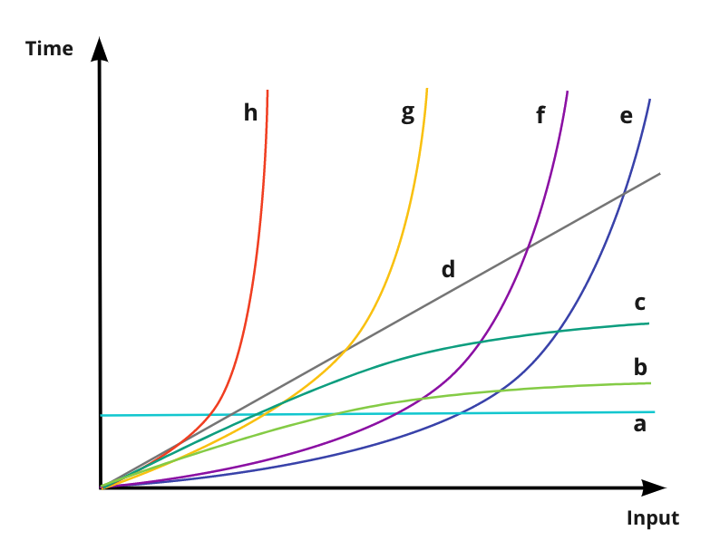

Types of curve relating to different algorithmic time complexity, in order of efficiency

Curve | Type         | Big O
------|--------------|------
a     | Constant     | O(1)
b     | Logarithmic  | O(log n)
c     | Square root  | O(sqrt n)
d     | Linear       | O(n)
e     | Quadratic    | O(n^2)
f     | Cubic        | O(n^3)
g     | Polynomial   | O(n^C) **
h     | Exponential  | O(2^n)

** C = constant number > 1
## Building a timing framework

I used TDD to build a timing framework with a simple, flexible interface using Node.js and Mocha - see `./CodeTimer`. I then published it as a package on NPM.

The CodeTimer class can be imported and used to time code. The `#run()` function can be passed an object containing a method to time and a starting array size. It will then automatically generate 20 arrays increasing in size, filled with random numbers. It then runs the method on each array, printing the size and the run time to the console. 4 additional arrays are run at the start, in order to warm up the system and reduce any

The timer can be used to time custom functions as well as built it ones. It can be used to time a single run or multiple. It can also be used manually to time the efficiency of any code, using the `#start()` and `#finish()` functions.

### Results

## Built in methods

### Reverse

#### Graph

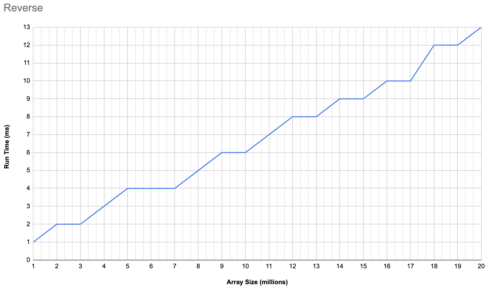

#### Time complexity
* **Linear**
* **O(n)**

### Sort

#### Graph
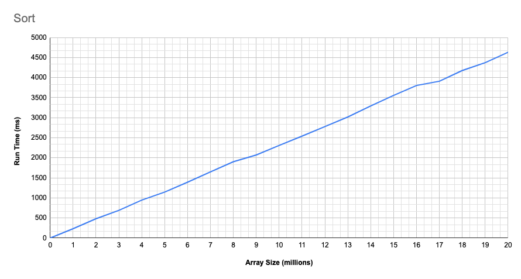

#### Time complexity
* **Linear**
* **O(n)**

## Building Custom Algorithms

### Find duplicates

Return the elements in a array which appear more than once.

[View Algorithm](https://github.com/AJ8GH/algorithmic-complexity/blob/main/algorithms/lib/findDuplicates.js)

#### Graph
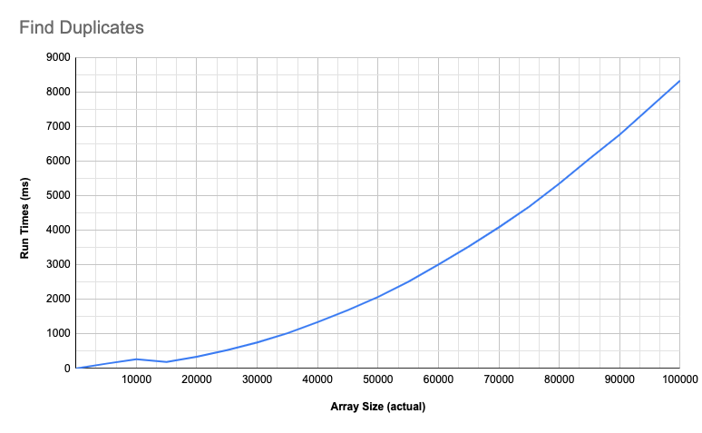

#### Time complexity
* **Quadratic**
* **O(n^2)**

### Bubble Sort

Sort an array by swapping neighbouring elements until the entire array is sorted.

[View Algorithm](https://github.com/AJ8GH/algorithmic-complexity/blob/main/algorithms/lib/bubbleSort.js)

#### Graph
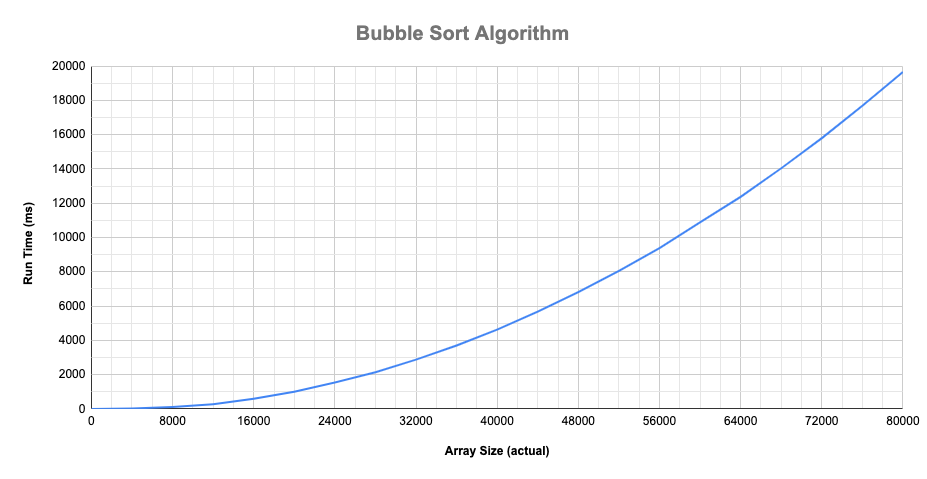

#### Time complexity
* **Quadratic**
* **O(n^2)**

### Shuffle

Create an algorithm to shuffle an array.

[View Algorithm](https://github.com/AJ8GH/algorithmic-complexity/blob/main/algorithms/lib/shuffle.js)

#### Graph

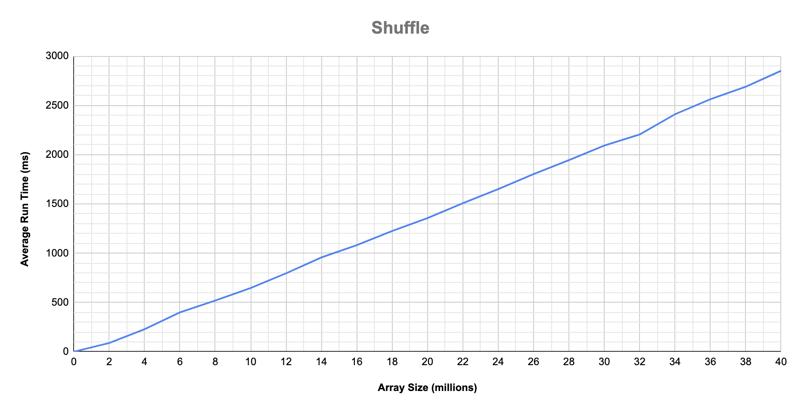

#### Time complexity
* **Linear**
* **O(n)**

### Custom Reverse

Reverse an array without using the built in reverse function.

[View Algorithm](https://github.com/AJ8GH/algorithmic-complexity/blob/main/algorithms/lib/reverse.js)

#### Graph
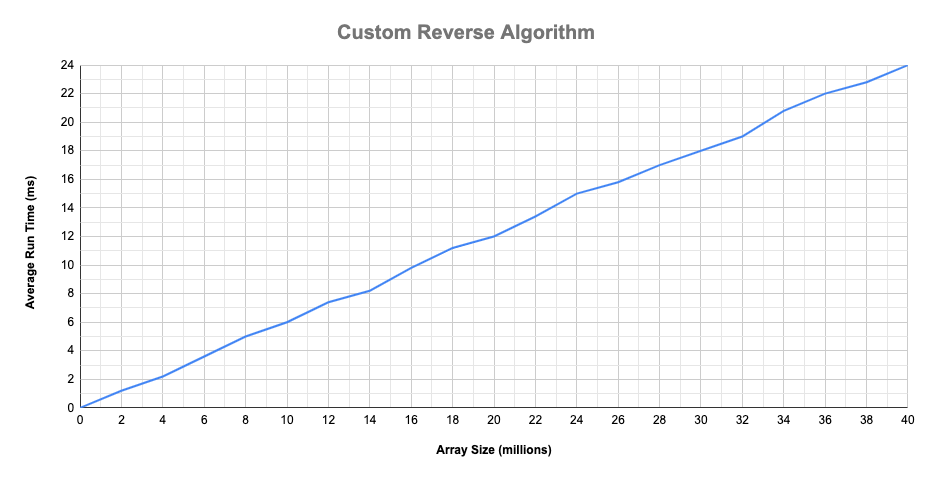

#### Time complexity
* **Linear**
* **O(n)**

### Last

Return last element of array.

[View Algorithm](https://github.com/AJ8GH/algorithmic-complexity/blob/main/algorithms/lib/last.js)

#### Time complexity
* **Constant**
* **O(1)**

## Memory

* Memory is stored in the heap
* Everything stored in binary
* Data and its type are both stored as binary, so that computer knows what the binary represents
* Bit is one binary digit (0 or 1)
* Byte is 8 bits
* Nibble is 4 bits - half a byte

Binary

256   | 128   | 64   | 32   | 16   | 8   |  4  | 2   | 1
------|-------|------|------|------|-----|-----|-----|-----
252^8 | 122^7 | 62^6 | 32^5 | 12^4 | 2^3 | 2^2 | 2^1 | 2^0

**largest integer in 1 byte = 255**

256   | 128   | 64   | 32   | 16   | 8   |  4  | 2   | 1
------|-------|------|------|------|-----|-----|-----|-----
0     | 1     | 1    | 1    | 1    | 1   | 1   | 1   | 1

**256:**

256   | 128   | 64   | 32   | 16   | 8   |  4  | 2   | 1
------|-------|------|------|------|-----|-----|-----|-----
1     | 0     | 0    | 0    | 0    | 0   | 0   | 0   | 0

When data is stored in memory it is given a hexidecimal memory address, corresponding to its space in memory

Modern computers use 64 bit architecture for memory addresses

### Arrays

When an array is stored, each element is stored consecutively. The length of the array is also stored. This is why finding the last element of an array is always constant time.

**Dynamic arrays:**

Ruby, JavaScript, Python, etc.

When storing a dynamic array, double the length is allocated, to allow for adding elements to array.

Once the limit is reached, the memory allocation is abandoned, and a new allocation is made, for double the new length.

**Static / primitive arrays:**

C, Java, etc.

When creating a static array, the size must be specified, this is fixed and can never change. This is more memory efficient but also adds complications in terms of memory handling in languages like C. Dynamic languages abstract this for you.

### Cost of operations

* Adding to end of array - constant time
* Reading last element of array - constant time
* Insert at start of array - linear time
* Deleting at end of array - constant time
* Deleting at start of array - linear time
* Finding array element by value - linear time

## Optimising Algorithms 

### Quadratic Shuffle

A shuffle algorithm where efficiency can be improved

```js
function quadraticShuffle (array) {
  const newArray = []
  while (true) {
    const random = Math.floor(Math.random() * array.length)
    const el = array.splice(random, 1)[0]
    newArray.push(el)
    if (array.length === 0) { break }
  }
  return newArray
}
```

Algorithm is quadratic since it iterates through the array and performs a linear operation of delete at a specific index on each iteration:

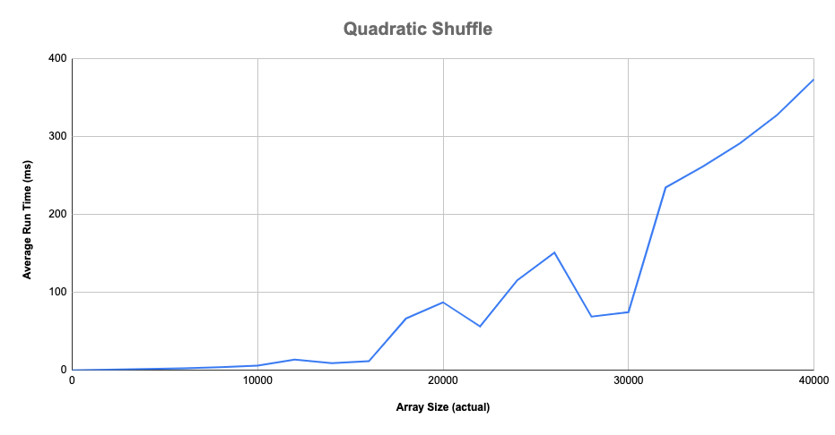

### Improved (Linear) Shuffle

To improve the algorithm, instead of deleting from the middle of the array, we can swap it with the last element before deleting it, substituting a linear operation with a constant one:

```js
function linearShuffle (array) {
  const newArray = []
  while (array.length > 0) {
    const random = Math.floor(Math.random() * array.length)
    const el = array[random]
    newArray.push(el)
    array[random] = array[array.length - 1]
    array[array.length - 1] = el
    array.pop()
  }
  return newArray
}
```

The new algorithm runs much faster, in linear time:

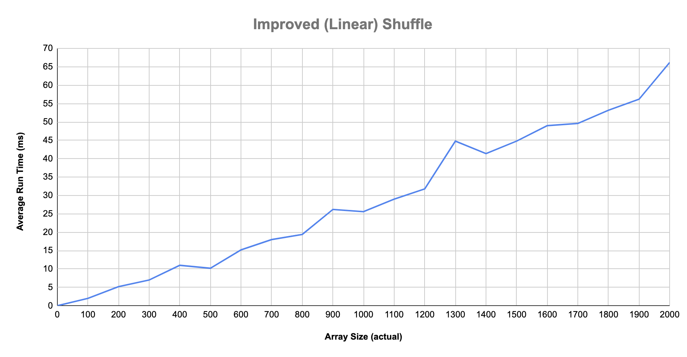

### Quadratic Reverse

The algorithm is quadratic, due to inserting at the start of an array - a linear operation - on every iteration

```js
function quadraticReverse (arr) {
  const newArr = []
  for (let i = 0; i < arr.length; i++) {
    newArr.unshift(arr[i])
  }
  return newArr
}
```

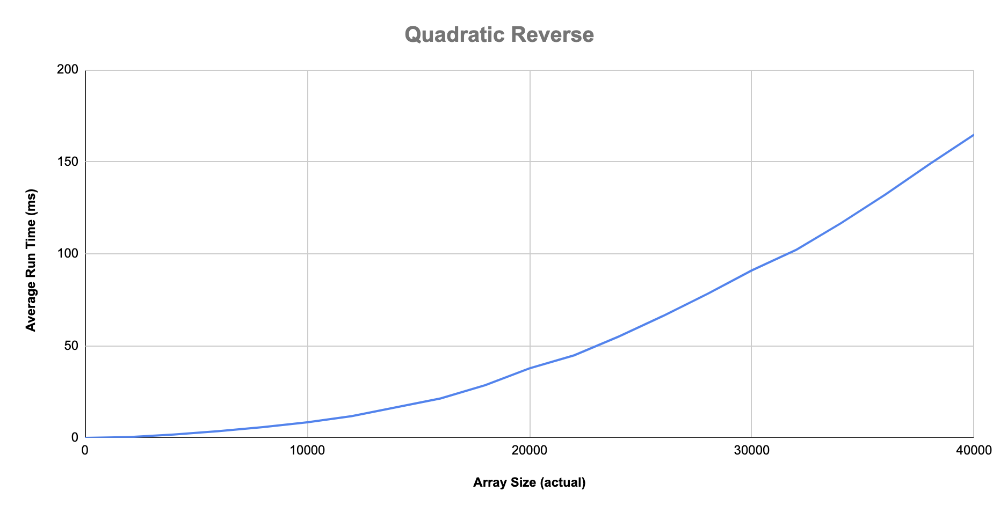

## Data Structures

Ways to store data in Memory. Can be optimised for different use cases. E.g. arrays and lists are ordered. Hashes have faster lookup times. etc.

### Different Data Structures

* Array / List
* Object
* Hash / Dictionary
* Set / Hashtable
* Tuple
* Linked List
* Tree
* Trie
* Graph
* Queue
* Stack

### Exercise

Lookup times in arrays are linear. Design a data structure so that it's lookup time will be constant.

### Solutions

#### Solution 1

Element stored in memory index corresponding to its value:

```js
// store
memory[value] = value

// find
memory[value]

// delete
memory[value] = nil
```

Improvements on array: constant look up and delete

Trade-offs: unordered, possible collisions, can't store duplicates, difficult to store very large numbers

#### Solution 2

Element stored at index == (value % length of memory allocation)

```js
// store
memory[value % memory.length] = value

// find
memory[value % memory.length]

// delete
memory[value % memory.length] = nil

// example - memory length = 15
// store the number 2:
memory.length == 15

2 % 15 = 2

memory[2] = 2
```

Improvements on solution 1: still constant look up and delete, more memory efficient - can store bigger numbers

Trade-offs: still unordered, collisions possible

#### Solution 3

Each memory index is either nil or links to an array of up to 5 elements

element stored in array, which is stored at memory index == value % memory length
colliding numbers are stored in the array
to find value, go to correspondning index and iterate through the array.

```js
// store
memory[value % memory.length].push(value)

// find
array = memory[value % memory.length]

array.filter(element => element === value)[0]

// delete
array = memory[value % memory.length]

newArray.filter(element => element !== value)

memory[value % memory.length] = newArray

// example - memory length = 15
// store the numbers 2 and 17:
memory.length == 15

2 % 15 = 2
memory[2] = [2]

17 % 15 = 2
memory[2] = [2, 17]
```

Improvements on solution 2: still constant look up and delete, since only have to iterate through 5 numbers max, less chance of collisions, can store more numbers

Trade-offs: still unordered, collisions still possible, even if less frequent

### Hash Table

Same as solution 3, but re-map anytime you get too many collisions - i.e. double the memory allocation (and maybe + 1 to change the modulo and reduce the collisions)

- Different to a hash map or a dictionary - does not use key value pairs
- Collection of values only
- Very quick operations - constant add, delete and find
- No duplicates
- No order

#### Hash / Hashmap / Dictionary

**Hashes** and **Dictionaries** are also based on hash tables, but instead of storing values, they store keys which point to values. Uses the same data structure as a hash table to store the keys - arrays of keys stored at value % mem.length, remapping to make more space when collisions occur.

- Look up by key is constant time
- Look up by value is linear since it has to loop through every key

Limitations of current structure - storing non numeric values

## Linear find duplicates

Find duplicates algorithm with linear complexity, through using sets.

[Algorithm](https://github.com/AJ8GH/algorithmic-complexity/blob/main/algorithms/lib/linearFindDuplicates.js)

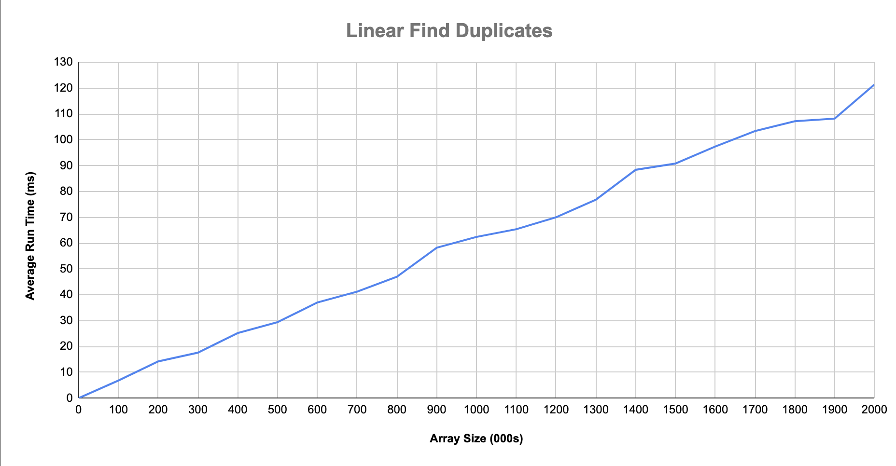
