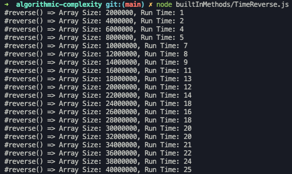
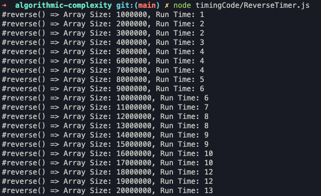
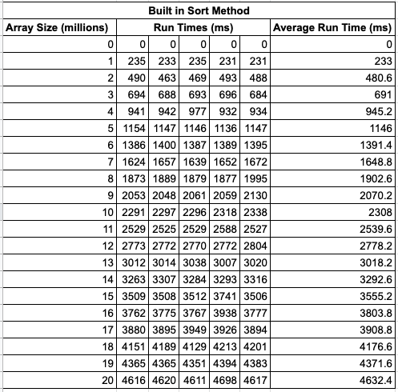
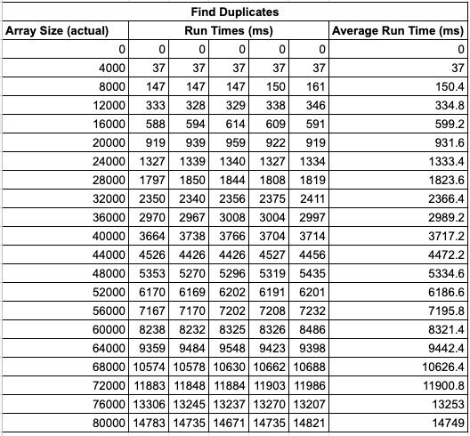

Algorithmic Complexity
======================

    

A course focused on Computer Science concepts around algorithmic complexity.

## Learning objectives

* Analyse how efficient programmes and algorithms are.
* Take a deeper look at how programmes interact with memory.
* How to use that to make our own programmes faster.

By the end of this course, the goal is to be able to answer "yes" to these questions:

* **Mention efficiency as one of the dimension of a good piece of code**
* **Join a conversation about algorithms and their complexity**

## Overview of the course

* Create a framework to time different built in algorithms and compare their efficiency
* Write custom algorithms, trying to be as efficient as possible

## Time Complexity

Types of curve relating to different algorithmic time complexity, in order of efficiency

Curve | Type         | Big O
------|--------------|------
a     | Constant     | O(1)
b     | Logarithmic  | O(log n)
c     | Square root  | O(sqrt n)
d     | Linear       | O(n)
e     | Quadratic    | O(n^2)
f     | Cubic        | O(n^3)
g     | Polynomial   | O(n^C) **
h     | Exponential  | O(2^n)

** C = constant number > 1

## Building a timing framework

I used TDD to build a timing framework using Node.js and Mocha - see `./lib/`

I designed the framework so that it had as simple an interface as possible. The `#run()` function in the `AlgorithmRunner` class be passed an object containing a method to time and, and a starting array size. It will then automatically generate 20 arrays increasing in size by the a step-size of the initial amount, filled with random numbers. the code timer class will then run the method under test for each array, outputting the results to the console.

I ran the code timer for the built in JS Array methods `#reverse()` and `#sort()`. I then took the output and plotted graphs to analyse the time complexity of these algorithms. The results are below.

### Results

## Built in methods

### Reverse

#### Terminal output

#### Results

#### Graph

Time complexity:
* Linear
* **O(n)**

### Sort

#### Terminal output

#### Results

#### Graph

Time complexity:
* Linear
* **O(n)**

## Building Custom Algorithms

### Find duplicates
Given an array of strings or numbers, find all the elements that appear more than once.

Input                    | Output
-------------------------|--------------
`[1]`                    | `[]`
`[1, 1]`                 | `[1, 1]`
`[1, 1, 2]`              | `[1, 1]`
`[1, 1, 2, 'a', 'a']`    | `[1, 1, 'a', 'a']`
`[]`                     | `[]`
`[2, '2']`               | `[]`

### Results

Time complexity:
* Quadratic
* **O(n^2)**
