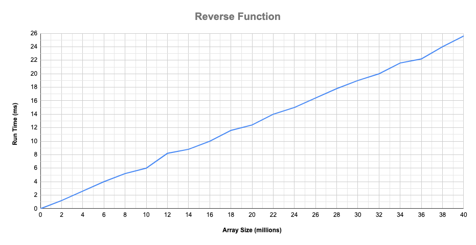
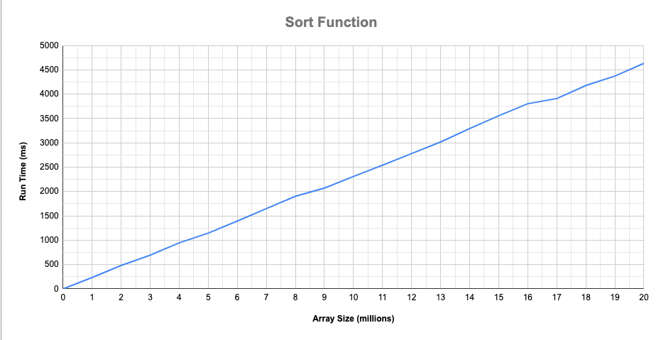
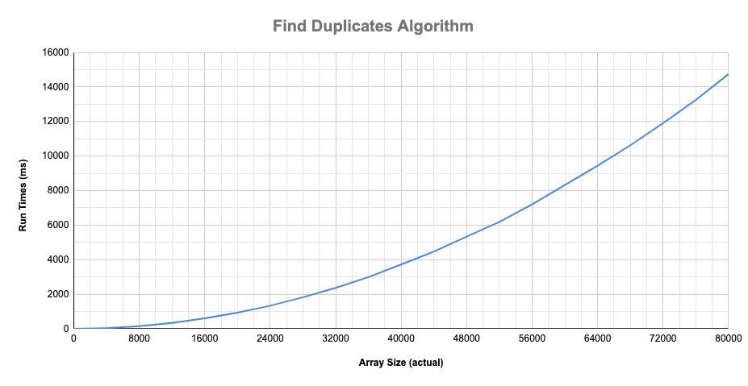

Algorithmic Complexity
======================

[](https://travis-ci.com/AJ8GH/algorithmic-complexity) [](https://codecov.io/gh/AJ8GH/algorithmic-complexity) [](https://codeclimate.com/github/AJ8GH/algorithmic-complexity/maintainability) [](https://standardjs.com) [](https://bettercodehub.com/)

A course focused on Computer Science concepts around algorithmic complexity.

## Learning objectives

* Analyse how efficient programmes and algorithms are.
* Take a deeper look at how programmes interact with memory.
* How to use that to make our own programmes faster.


By the end of this course, the goal is to be able to answer "yes" to these questions:

* **Mention efficiency as one of the dimension of a good piece of code**
* **Join a conversation about algorithms and their complexity**

## Overview of the course

* Create a framework to time different built in algorithms and compare their efficiency
* Write custom algorithms, trying to be as efficient as possible

## Time Complexity


Types of curve relating to different algorithmic time complexity, in order of efficiency

Curve | Type         | Big O
------|--------------|------
a     | Constant     | O(1)
b     | Logarithmic  | O(log n)
c     | Square root  | O(sqrt n)
d     | Linear       | O(n)
e     | Quadratic    | O(n^2)
f     | Cubic        | O(n^3)
g     | Polynomial   | O(n^C) **
h     | Exponential  | O(2^n)

** C = constant number > 1
## Building a timing framework

I used TDD to build a timing framework with a simple, flexible interface using Node.js and Mocha - see `./CodeTimer`. I then published it as a package on NPM.

The CodeTimer class can be imported and used to time code. The `#run()` function can be passed an object containing a method to time and a starting array size. It will then automatically generate 20 arrays increasing in size, filled with random numbers. It then runs the method on each array, printing the size and the run time to the console. 4 additional arrays are run at the start, in order to warm up the system and reduce any

The timer can be used to time custom functions as well as built it ones. It can be used to time a single run or multiple. It can also be used manually to time the efficiency of any code, using the `#start()` and `#finish()` functions.

### Results

## Built in methods

### Reverse

#### Graph



#### Time complexity
* **Linear**
* **O(n)**

### Sort

#### Graph


#### Time complexity
* **Linear**
* **O(n)**

## Building Custom Algorithms

### Find duplicates

Return the elements in a array which appear more than once.

[View Algorithm](https://github.com/AJ8GH/algorithmic-complexity/blob/main/algorithms/lib/findDuplicates.js)

#### Graph


#### Time complexity
* **Quadratic**
* **O(n^2)**

### Bubble Sort

Sort an array by swapping neighbouring elements until the entire array is sorted.

[View Algorithm](https://github.com/AJ8GH/algorithmic-complexity/blob/main/algorithms/lib/bubbleSort.js)

#### Graph


#### Time complexity
* **Quadratic**
* **O(n^2)**

### Shuffle

Create an algorithm to shuffle an array.

[View Algorithm](https://github.com/AJ8GH/algorithmic-complexity/blob/main/algorithms/lib/shuffle.js)

#### Graph


#### Time complexity
* **Linear**
* **O(n)**

### Custom Reverse

Reverse an array without using the built in reverse function.

[View Algorithm](https://github.com/AJ8GH/algorithmic-complexity/blob/main/algorithms/lib/reverse.js)

#### Graph


#### Time complexity
* **Linear**
* **O(n)**

### Last

Return last element of array.

[View Algorithm](https://github.com/AJ8GH/algorithmic-complexity/blob/main/algorithms/lib/last.js)

#### Time complexity
* **Constant**
* **O(1)**

## Improving Efficiency of Algorithms

### Quadratic Shuffle

A shuffle algorithm where efficiency can be improved

```js
function quadraticShuffle (array) {
  const newArray = []
  while (true) {
    const random = Math.floor(Math.random() * array.length)
    const el = array.splice(random, 1)[0]
    newArray.push(el)
    if (array.length === 0) { break }
  }
  return newArray
}
```

Algorithm is quadratic since it iterates through the array and performs a linear operation of delete at a specific index on each iteration:


To improve the algorithm, instead of deleting from the middle of the array, we can swap it with the last element before deleting it, substituting a linear operation with a constant one:

```js
export default function linearShuffle (array) {
  const newArray = []
  while (array.length > 0) {
    const random = Math.floor(Math.random() * array.length)
    const el = array[random]
    newArray.push(el)
    array[random] = array[array.length - 1]
    array[array.length - 1] = el
    array.pop()
  }
  return newArray
}
```

The new algorithm runs much faster, in linear time:


