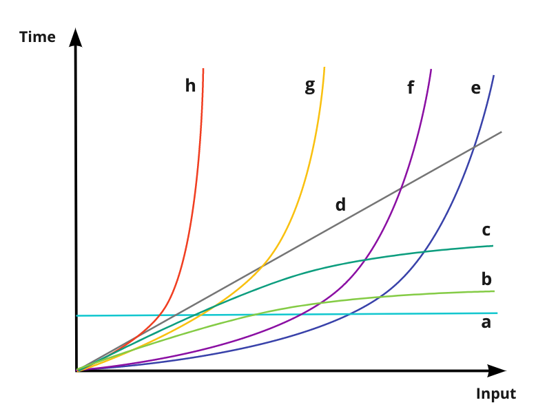

Time Complexity
===============

Types of curve relating to different algorithmic time complexity, in order of efficiency

Curve | Type         | Big O
------|--------------|------
a     | Constant     | O(1)
b     | Logarithmic  | O(log n)
c     | Square root  | O(sqrt n)
d     | Linear       | O(n)
e     | Quadratic    | O(n^2)
f     | Cubic        | O(n^3)
g     | Polynomial   | O(n^C) **
h     | Exponential  | O(2^n)

** C = constant number > 1
